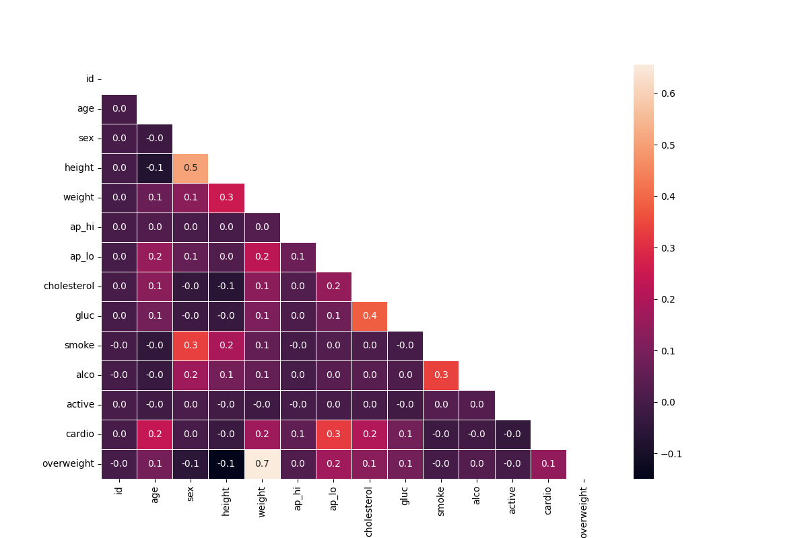

# Medical Data Visualizer

This repository contains a Python script for visualizing medical examination data. The script generates a categorical plot and a heatmap to analyze various health factors.

## Table of Contents
- [Introduction](#introduction)
- [Features](#features)
- [Installation](#installation)
- [Usage](#usage)
- [Output](#output)
- [Contributing](#contributing)
- [License](#license)

## Introduction

The **Medical Data Visualizer** project uses a dataset containing medical examination data to compute and visualize various statistics. This tool is useful for understanding the relationships between different health factors.

## Features

- Adds an 'overweight' column based on BMI calculation.
- Normalizes cholesterol and glucose data.
- Generates a categorical plot to show the counts of various health indicators split by cardiovascular disease presence.
- Creates a heatmap to visualize the correlation between different health metrics.

## Installation

To use this project, you need to have Python, Pandas, Seaborn, and Matplotlib installed on your system. You can install the required packages using pip:

\`\`\`bash
pip install pandas seaborn matplotlib
\`\`\`

## Usage

1. Clone this repository to your local machine.
2. Ensure that you have the required dependencies installed.
3. Place the dataset file (\`medical_examination.csv\`) in the same directory as the script.
4. Run the script to generate and save the visualizations.

## Output

The script will output the following visualizations:

- Categorical Plot:
  

- Heatmap:
  

## Contributing

Contributions are welcome! Please feel free to submit a Pull Request.

## License

This project is licensed under the MIT License. See the [LICENSE](LICENSE) file for details.
